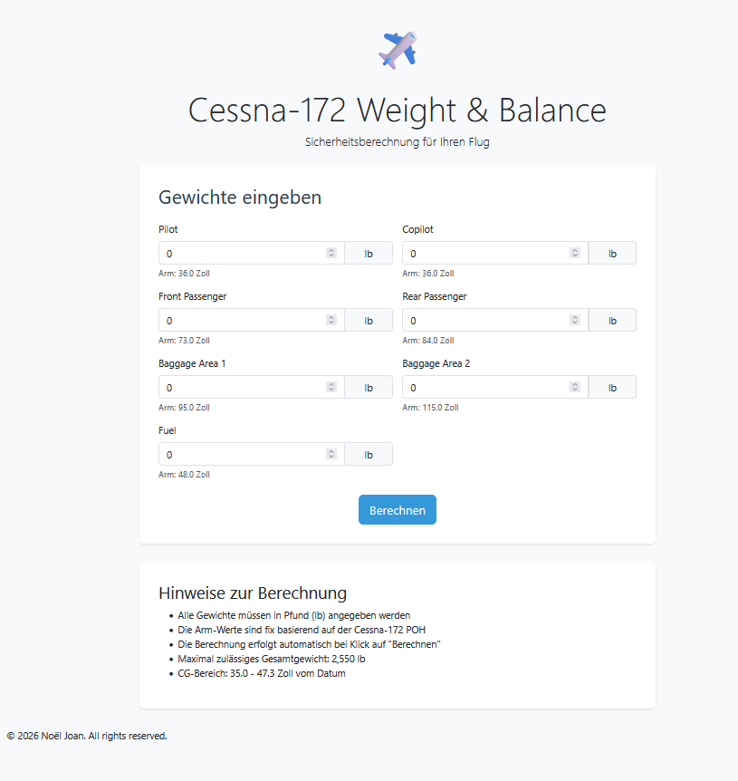

# ✈️ Cessna-172 Weight & Balance Calculator

- Cessna-172 Weight & Balance Calculator: <https://weight-and-balance.onrender.com/>

Eine professionelle Web-Anwendung zur Berechnung von Gewicht und Schwerpunkt (Center of Gravity) für die **Cessna 172** – sicher, schnell und präzision.


## 📋 Übersicht

Dieses Tool hilft Piloten und Flugplanern, die **Gewichts- und Schwerpunktverteilung** einer Cessna 172 korrekt zu berechnen – eine wesentliche Sicherheitsmaßnahme vor jedem Flug. Die Anwendung prüft automatisch, ob die Beladung innerhalb der zulässigen Grenzen (POH-Spezifikationen) liegt.

## Screenshot



#### Hauptmerkmale:

- 🌐 **Web-Oberfläche** (Flask-basiert)
- 🖥️ **Desktop-GUI** (Tkinter)
- 🧮 **Kernlogik** als wiederverwendbare Python-Bibliothek
- ✅ **Automatische Sicherheitsprüfung** der CG-Grenzen
- 📊 **Detaillierter Bericht** mit allen Berechnungen

## 🚀 Installation

### Voraussetzungen

- Python 3.9 oder höher
- pip oder Poetry

### Mit pip installieren

```bash
# Repository klonen
git clone https://github.com/<your-username>/weight-and-balance.git
cd weight-and-balance

# Virtuelle Umgebung erstellen
python -m venv venv
source venv/bin/activate  # Linux/macOS
# oder: venv\Scripts\activate  # Windows

# Abhängigkeiten installieren
pip install -r requirements.txt
```

### Mit Poetry installieren

```bash
git clone https://github.com/<your-username>/weight-and-balance.git
cd weight-and-balance
poetry install
```

## 💻 Verwendung

### Web-Anwendung starten

```bash
python src/web_app.py
```

Anschließend im Browser öffnen: <http://localhost:5000>

### Desktop-GUI starten

```bash
python src/gui.py
```

### Programmgesteuert verwenden

```python
from src.item import WeightItem
from src.calculator import WeightAndBalance

items = [
    WeightItem("Pilot", 170, 36.0),
    WeightItem("Fuel", 84, 48.0),
    WeightItem("Baggage", 30, 95.0),
]

wb = WeightAndBalance(items)
print(wb.report())

ok, note = wb.is_within_limits()
print(f"Sicherheit: {'OK' if ok else 'NICHT OK'}")
```

## 📊 Berechnung

Die Berechnung basiert auf der Standardformel:

```
Moment = Gewicht × Arm
Gesamtgewicht = Σ Gewichte
CG-Position = Gesamt-Moment / Gesamtgewicht
% MAC = ((CG-Position - Datum) / MAC) × 100
```

### Standardwerte (Cessna-172 POH)

| Parameter                 | Wert              |
|---------------------------|-------------------|
| Datum                     | 36.0 in           |
| MAC-Länge                 | 57.0 in           |
| Max. Gesamtgewicht        | 2.550 lb          |
| CG-Vordergrenze          | 35.0 in (0% MAC)  |
| CG-Hintergrenze          | 47.3 in (20% MAC) |
|                          |                   |
|Umrechnungsfaktor         | 1 lb = 0,453592 kg|

### Arm-Positionen (Standard)

| Position               | Arm (in) |
|------------------------|----------|
| Pilot / Copilot        | 36.0     |
| Front Passenger        | 73.0     |
| Rear Passenger         | 84.0     |
| Baggage Area 1         | 95.0     |
| Baggage Area 2         | 115.0    |
| Fuel                   | 48.0     |

## 🧪 Tests

```bash
# Mit pytest
pytest tests/

# Mit Poetry
poetry run pytest
```

## 📁 Projektstruktur

```
weight-and-balance/
│
├── src/                          # Quellcode
│   ├── __init__.py
│   ├── constants.py              # Flugzeug-spezifische Konstanten
│   ├── item.py                   # Datenmodell für Gewichtsposten
│   ├── calculator.py             # Kernlogik
│   ├── gui.py                    # Tkinter Desktop-GUI
│   └── web_app.py                # Flask Web-App
│
├── templates/                    # HTML-Templates
│   ├── index.html                # Eingabeformular
│   └── result.html               # Ergebnis-Anzeige
│
├── static/                       # CSS, JS, Bilder
├── tests/                        # Unit-Tests
│   └── test_calculator.py
│
├── .gitignore
├── pyproject.toml                # Projekt-Metadaten
├── README.md
└── LICENSE
```

## 🔒 Sicherheitshinweis

> ⚠️ **WICHTIG**: Diese Software ist ein Hilfsmittel und ersetzt **nicht** die offizielle Berechnung gemäß dem **Pilot's Operating Handbook (POH)** Ihrer spezifischen Cessna 172. Verwenden Sie immer die Werte aus dem POH Ihres Flugzeugs für die endgültige Flugvorbereitung.

## 🛣️ Roadmap

- [ ] Mehrere Flugzeugprofile (C172S, C172R, C182, ...)
- [ ] CSV/Excel-Import für Beladungs-Konfigurationen
- [ ] Grafische CG-Darstellung (Diagramm)
- [ ] Mobile-optimierte Ansicht (PWA)
- [ ] Mehrsprachige Oberfläche (DE/EN)
- [ ] API-Endpunkt (REST) für Integrationen

## 🤝 Beitragen

Beiträge sind willkommen! So können Sie helfen:

1. Forken Sie das Repository
2. Erstellen Sie einen Feature-Branch (`git checkout -b feature/AmazingFeature`)
3. Committen Sie Ihre Änderungen (`git commit -m 'Add some AmazingFeature'`)
4. Pushen Sie den Branch (`git push origin feature/AmazingFeature`)
5. Öffnen Sie einen Pull Request

## 📝 Lizenz

Dieses Projekt steht unter der MIT-Lizenz – siehe [LICENSE](LICENSE) Datei für Details.

## 👨‍💻 Autor

**Noel Joan**
- GitHub: [@noeljoan](https://github.com/noeljoan)
- Email: noel.joan@hotmail.com
- Cessna-172 Weight & Balance Calculator: <https://weight-and-balance.onrender.com/>

## 🙏 Danksagung

- Cessna 172 POH für die Referenzwerte
- Flask-Community für das großartige Framework
- Alle Piloten, die zur Sicherheit in der Luftfahrt beitragen

---
⭐ Wenn dieses Projekt Ihnen gefällt, geben Sie ihm einen Stern auf GitHub!
